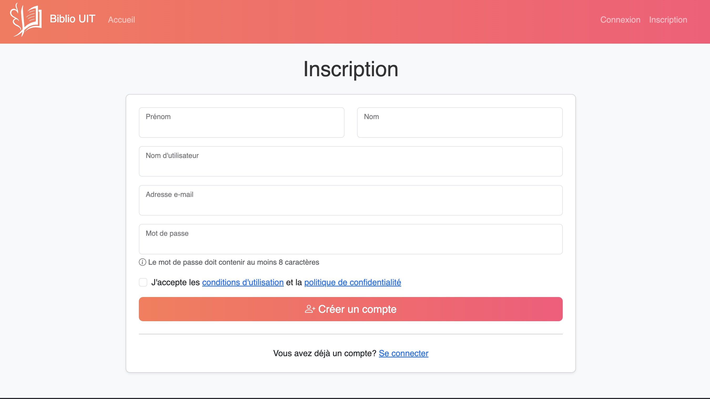

# BiblioNum - Bibliothèque Numérique

## Description
BiblioNum est une application de gestion de bibliothèque numérique développée avec Spring Boot. Le projet est en cours de développement et se concentre actuellement sur la gestion des utilisateurs et l'authentification.

## Captures d'écran
### Page d'inscription



## Création du Projet
Ce projet a été créé avec [Spring Initializr](https://start.spring.io/) en utilisant les paramètres suivants :
- **Type de projet** : Maven
- **Langage** : Java
- **Version de Spring Boot** : 3.4.5
- **Packaging** : WAR
- **Version de Java** : 17

## Dépendances
Le projet utilise les dépendances suivantes :

### Spring Boot Starters
- **Spring Boot Starter Data JPA** : Support pour la persistance des données avec JPA
- **Spring Boot Starter Web** : Support pour le développement d'applications web
- **Spring Boot Starter Security** : Fonctionnalités de sécurité pour l'authentification et l'autorisation
- **Spring Boot Starter Thymeleaf** : Moteur de template pour les vues
- **Spring Boot Starter Tomcat** : Serveur d'application Tomcat (fourni)
- **Spring Boot DevTools** : Outils de développement pour améliorer la productivité

### Base de données
- **SQLite JDBC** : Driver JDBC pour SQLite
- **Hibernate Community Dialects** : Support pour les dialectes SQL non standards

### Sécurité
- **Thymeleaf Extras Spring Security** : Intégration de Spring Security avec Thymeleaf

### Validation
- **Jakarta Validation API** : API de validation des beans

### Outils
- **Lombok** : Bibliothèque pour réduire le code boilerplate (getters, setters, etc.)

### Tests
- **Spring Boot Starter Test** : Support pour les tests unitaires et d'intégration
- **Spring Security Test** : Outils pour tester les fonctionnalités de sécurité

## Structure du Projet
Le projet suit la structure standard des applications Spring Boot :
```
src/
  main/
    java/uit/fs/bibliotheque/  # Code source Java
      config/                  # Configuration Spring
      controller/              # Contrôleurs REST et MVC
      model/                   # Entités JPA
      repository/              # Repositories Spring Data
      service/                 # Services métier
    resources/
      application.properties   # Configuration de l'application
      static/                  # Ressources statiques (CSS, JS, images)
      templates/               # Templates Thymeleaf
  test/                        # Tests unitaires et d'intégration
```

## Modèles
Actuellement, le projet ne contient que le modèle suivant :

### Utilisateur
- Gestion des utilisateurs et de l'authentification
- Fonctionnalités d'inscription et de connexion implémentées
- Sécurisation des accès avec Spring Security

*Note: Les autres fonctionnalités comme la gestion des livres, des auteurs, des catégories et des emprunts seront ajoutées dans les futures mises à jour du projet.*

## Installation et Configuration

### Prérequis
- JDK 17
- Maven 3.6+

### Installation
1. Clonez le dépôt :
```bash
git clone https://github.com/awssam/biblio-num-spring.git
cd biblio-num-spring
```

2. Compilez et lancez l'application :
```bash
mvn clean install
mvn spring-boot:run
```

3. Accédez à l'application via : `http://localhost:8080`

## Documentation
Pour plus d'informations, consultez:
- [Documentation des catégories](docs/categories.md) - Gestion des catégories de livres
- Documentation des APIs et des URLs dans le fichier de documentation du projet


## Licence
MIT License

Copyright (c) 2025 

Permission is hereby granted, free of charge, to any person obtaining a copy
of this software and associated documentation files (the "Software"), to deal
in the Software without restriction, including without limitation the rights
to use, copy, modify, merge, publish, distribute, sublicense, and/or sell
copies of the Software, and to permit persons to whom the Software is
furnished to do so, subject to the following conditions:

The above copyright notice and this permission notice shall be included in all
copies or substantial portions of the Software.

THE SOFTWARE IS PROVIDED "AS IS", WITHOUT WARRANTY OF ANY KIND, EXPRESS OR
IMPLIED, INCLUDING BUT NOT LIMITED TO THE WARRANTIES OF MERCHANTABILITY,
FITNESS FOR A PARTICULAR PURPOSE AND NONINFRINGEMENT. IN NO EVENT SHALL THE
AUTHORS OR COPYRIGHT HOLDERS BE LIABLE FOR ANY CLAIM, DAMAGES OR OTHER
LIABILITY, WHETHER IN AN ACTION OF CONTRACT, TORT OR OTHERWISE, ARISING FROM,
OUT OF OR IN CONNECTION WITH THE SOFTWARE OR THE USE OR OTHER DEALINGS IN THE
SOFTWARE.